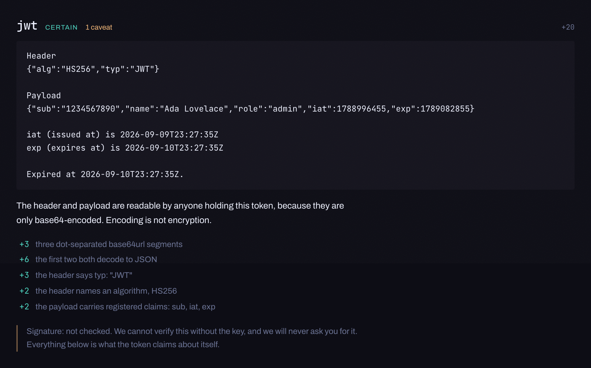

# decoder

One box. Paste anything and it says what it is.

A token, a hash, a timestamp, an ID, something encoded twice. It names it, decodes it, and
expands what it finds inside, so a JWT becomes its header and payload and the timestamp
inside the payload becomes a date.



**Nothing leaves your browser, and that is enforced rather than promised.**

## Try it

**[rlawoals0529.github.io/decoder](https://rlawoals0529.github.io/decoder/)**

## What it reads

JWT, base64 and base64url, hex with its candidate digests, JSON, URLs, query strings, unix
timestamps in seconds or milliseconds, UUIDs with their version and embedded time, and a
plain-number baseline.

**Nothing is read by one detector.** A JWT emits its header and payload, the JSON detector
emits the interesting fields inside them, and the timestamp detector reads the `exp` it
never knew was coming. Paste an OAuth callback URL and it reaches the token in
`access_token`, then its payload, then the date inside the payload. No detector knows about
any other; the engine walks what each one emits, breadth first, under a budget.

### Confidence is a list of reasons

Every reading shows what it is worth in bits and why, one line per reason, and evidence can
argue against a reading as well as for it. A float confidence was rejected: "87% likely MD5"
is precision nobody can justify, and the notes are the part you can actually use, because
you know where the string came from and this does not.

**Ambiguity is shown rather than resolved.** A bare 32-character hex string is equally well
explained as an MD5 and as a UUID with its dashes stripped, so both appear, joined by "or",
inside the one outlined thing on the page. Tabs would hide one behind a click, a dropdown
would imply a default, and a single best guess with the rest collapsed is picking while
looking humble.

That is only true when the evidence really is even. A bare **v7** UUID is not ambiguous,
because its first 48 bits decode to a real date and a hash has no reason to carry one. A
bare **v4** is, because it is random and carries nothing. Both cases are pinned by tests, in
opposite directions.

### Caveats

`caveats` is a required field and the card renders it unconditionally, never behind a
disclosure. A `certain` badge beside "signature not checked" is the normal look here, and it
is only safe because both are in the same glance: hide the caveat and the badge starts
meaning "verified".

The JWT card leads with **"Signature: not checked. We cannot verify this without the key, and
we will never ask you for it."** Verifying would need the secret, and asking for a signing
secret is asking for the one thing that should never be pasted anywhere.

Two more that matter:

- **A URL never renders as a link.** An anchor invites a hover preview or a prefetch, either
  of which hands a signed URL to a remote host without a click.
- **hex names candidates by length and says that is all it did.** A git object id is a SHA-1
  with no way to tell it apart without the repository, so it appears as one candidate among
  several rather than as its own confident reading that would be wrong most of the time.

### Budgets

Depth 4, 400 nodes, 64 KB, and a 50ms deadline. Hitting one is never a silent truncation: the
row says which budget stopped it and offers to continue from there with a fresh one, so a
limit is a decision you make rather than one you cannot see.

Termination is structural rather than a counter. A visited set is not enough on its own,
because something that decodes to a plausible re-encoding of itself cycles through values
that are each new, so a **decoding** seed is refused unless it is strictly shorter than its
parent.

## Privacy, enforced rather than promised

The built page carries this policy:

```
default-src 'none'; script-src 'self'; style-src 'self' 'unsafe-inline';
font-src 'self'; img-src 'self' data:; connect-src 'none';
base-uri 'none'; form-action 'none'
```

`connect-src 'none'` means the browser refuses every `fetch`, `XMLHttpRequest`,
`WebSocket`, `EventSource` and `sendBeacon` the page could attempt, **including from code
nobody here wrote.** That puts the guarantee on your browser rather than on my diligence.

Check it yourself. Open the console on the live page and run this, which is your code and
never shipped with the app:

```js
fetch("https://example.com/", { method: "POST", body: "anything" })
```

It is refused, and the console names `connect-src` as the reason. You can also grep the file
your browser actually downloaded, rather than the source:

```bash
curl -s https://rlawoals0529.github.io/decoder/assets/index-*.js \
  | node scripts/check-no-network.mjs -
```

`npm run e2e` is the suite that pins this, including a run with the network disabled.

## Desktop overlay

The same build runs as a [hikari](https://github.com/rlawoals0529/hikari) overlay bound to a
global shortcut. Copy a token, press the key, and it is already decoded. That interaction is
only possible outside a browser and it is the reason to have a desktop build at all.

The split is the interesting part:

| | Browser | Overlay |
| --- | --- | --- |
| Clipboard | none at all, and no permission asked | read by the host's own trusted process |
| Gate | not applicable | the widget's manifest must say `"clipboard": true` |
| Network | `connect-src 'none'` | the same `connect-src 'none'`, verified inside Electron |

**A permission prompt is a terrible look for a tool whose whole pitch is that it wants
nothing from you**, so the web build never asks. `check-no-network` forbids
`navigator.clipboard` outright. In the overlay the host reads the clipboard, gated on the
widget's own manifest, and pushes the text in by `postMessage`. Same core, two hosts, and
the privileged one is the one the user installed on purpose.

`?embed=1` is what turns the listener on, and without it the page registers no message
listener at all. The sender cannot be verified, because a page loaded from `file://` has an
origin of the string `"null"`, and what makes that acceptable is the direction of travel:
text goes in and **nothing ever comes back out**, so the worst a hostile framer could do is
type into a box you are looking at.

### The Electron CSP question

The concern going in was that `script-src 'self'` and `connect-src 'none'` resolve
differently for a `file://` origin, which would have meant a separate Electron-targeted
build. It was measured in the real host instead of reasoned about, and it holds: the policy
is present on the framed page, the app's own scripts run, and a `fetch` from inside the
overlay is refused with `connect-src` named as the directive. The privacy guarantee is the
same in both places.

## Running it

```bash
npm install
npm run dev          # no policy here, see below
npm run build        # typecheck, build, then refuse the build if it can reach the network
npm test             # unit
npm run e2e          # the privacy suite, against a production preview
```

**The policy is injected into the production build only, and there is a trap in that.**
Vite's dev server needs a WebSocket for hot reload and `connect-src 'none'` forbids it, so
in dev the page would appear broken. Somebody then repairs the dev server by weakening the
policy, and the strongest layer of this whole thing quietly dies. So the tests point at
`vite preview` instead, where the policy is real. Do not move them to the dev server.

## Dependencies

`scripts/check-deps.mjs` fails CI if anything else appears in `dependencies`, and it runs as
its own job so the reason a run went red is legible from the job list. Every runtime
dependency is code nobody here reviewed, running on a page people paste secrets into, and
`check-no-network` greps for primitives rather than reading intent: a dependency that built a
URL out of fragments would go straight past it.

Colours and type are [yozora](https://github.com/rlawoals0529/yozora), vendored.

MIT
